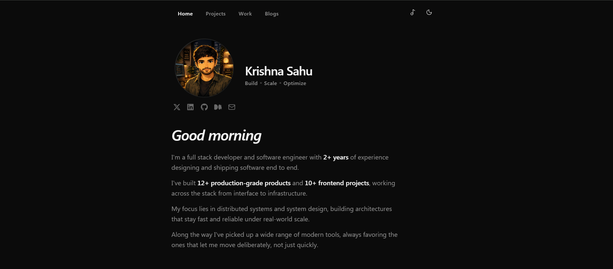

# Krishna Sahu — Portfolio

A personal portfolio built to showcase my work, resume, and writing — designed to feel minimal, fast, and a little personal along the way.



## About

This is my personal corner of the internet. It's where I share what I've built, what I've written, and how to get in touch. The site is built with a strong focus on typography, subtle motion, and a consistent design language across every page — from the resume viewer to the blog list to the booking card.

## Features

- **About** — a short introduction with a time-aware greeting and animated text reveal
- **Resume** — an in-browser PDF viewer with zoom controls and a one-click download, no external redirect required
- **Blogs** — a clean, scannable list of posts with smooth scroll-triggered animations
- **Let's Connect** — a simple booking card linking directly to my Cal.com page for scheduling calls
- **Anime Quotes** — a rotating quote carousel, because a portfolio can still have personality
- **Dark & Light Mode** — fully themed across every component using CSS variables, no flash of unstyled content
- **Responsive by Design** — every section is built mobile-first and tested down to small screens
- **Motion, Done Carefully** — Framer Motion powers entrance animations, staggered reveals, and page transitions without feeling heavy

## Tech Stack

- **Framework:** Next.js (App Router)
- **Language:** TypeScript
- **Styling:** Tailwind CSS v4
- **Animation:** Framer Motion
- **Icons:** Lucide React
- **PDF Rendering:** react-pdf
- **Scheduling:** Cal.com
- **Fonts:** Satoshi (variable font, self-hosted)

## Getting Started

Clone the repository and install dependencies:

```bash
git clone https://github.com/krishnasahu22032003/portfolio.git
cd portfolio
npm install
```

Run the development server:

```bash
npm run dev
```

Open [https://krishnastack.com](https://krishnastack.com) in your browser to see the site.

## Project Structure

```
├── app/                  # Next.js App Router pages
│   ├── about/
│   ├── blogs/
│   ├── resume/
│   └── connect/
├── components/           # Reusable UI components
├── lib/                  # Data and utility functions
├── public/               # Static assets (fonts, resume, images)
└── styles/               # Global styles and theme tokens
```

## Design Philosophy

Every page follows the same visual grammar — a serif italic heading, muted secondary text, soft borders, and consistent spacing — so the site feels like one cohesive experience rather than a set of disconnected pages. Motion is used sparingly and intentionally: to guide attention, not distract from it.

## Contact

If you'd like to get in touch, collaborate, or just say hello:

📧 **krishna.sahu.work@gmail.com**

Or head over to the **Let's Connect** page on the site to schedule a call directly.

## License

This project is open for reference and inspiration. If you use parts of it, a credit back would be appreciated.

---

Made with ❤️ by **Krishna**